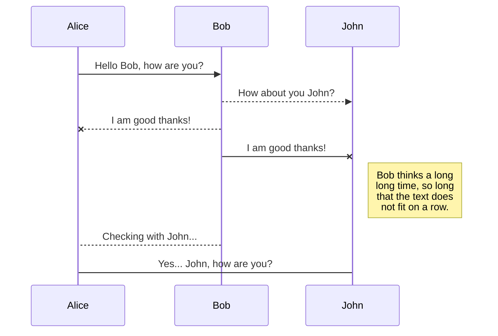
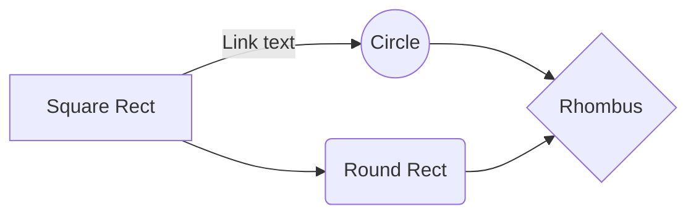

# Markdown Reference
---
[//]: # (-------------- Start Comment --------------)

[comment]: # (This is a comment)
[comment]: # "This is a comment"
[comment]: # 'This is a comment'

[comment]: # 'This is a comment'
[comment]: <> 'This is a comment'

[comment]: # 'This is a comment'
[//]: # 'This is a comment'

[//]: # (-------------- Start Headings --------------)

# Heading 1
## Heading 2
### Heading 3
#### Heading 4
##### Heading 5
###### Heading 6
#
Header 1
====================
Header 2
---------------------
## Header 2
## Header 2 ##
# 
___

[//]: # (-------------- Start Paragraph --------------)

## Paragraph
Now is the time for all good men to come to
the aid of their country. This is just a
regular paragraph. \<p> 
___

[//]: # (-------------- Start Strong & Italics --------------)
 
## Italic
_This text_ is italic
*This text* is italic

## Strong
__This text__ is Strong
**This text** is Strong

## Strong & Italics
***Strong & Italics***
___Strong & Italics___
___

[//]: # (-------------- Start Strikethrough --------------)

## strikethrough
~~This text~~ is strikethrough

___
[//]: # (-------------- Start Links --------------)

## Links
[Traversy Media](http://www.traversymedia.com "Traversy Media Title")

I get 10 times more traffic from [Google][1] than from
[Yahoo][2] or [MSN][3].

[1]: http://google.com/        "Google"
[2]: http://search.yahoo.com/  "Yahoo Search"
[3]: http://search.msn.com/    "MSN Search"

I get 10 times more traffic from [Google][] than from
[Yahoo][] or [MSN][].

  [google]: http://google.com/        "Google"
  [yahoo]:  http://search.yahoo.com/  "Yahoo Search"
  [msn]:    http://search.msn.com/    "MSN Search"

I start my morning with a cup of coffee and
[The New York Times][NY Times].

[ny times]: http://www.nytimes.com/
[ny times]: http://example.com/  "Optional Title Here"
[ny times]: http://example.com/  'Optional Title Here'
[ny times]: http://example.com/  (Optional Title Here)
[ny times]: <http://example.com/>  "Optional Title Here"
___

[//]: # (-------------- Start Inline Code Block --------------)

## Images 


![alt text][id]

[id]: https://markdown-here.com/img/icon256.png "Title"
___

[//]: # (-------------- Start Strong --------------)

## Images & Links
[](https://nodesource.com/products/nsolid)
[](https://travis-ci.org/joemccann/dillinger)
___

[//]: # (-------------- Start Unordered Lists --------------)

## Unordered Lists
*   Candy.
*   Gum.
*   Booze.

+   Candy.
+   Gum.
+   Booze.

-   Candy.
-   Gum.
-   Booze.

* Item 1
* Item 2
* Item 3
  * Nested Item 1
  * Nested Item 2
    - First nested list item
      - Second nested list item
___

[//]: # (-------------- Start Ordered Lists --------------)

## Ordered Lists

1.  (1) Red 
2.  (2) Green 
3.  (3) Blue 
>
1.  (1) Bird 
1.  (1) McHale 
1.  (1) Parish 
>
3. (3) Bird 
1. (1) McHale 
8. (8) Parish 
___

[//]: # (-------------- Start Lists --------------)

## Lists

*   A list item.
    With multiple paragraphs.
*   Another item in the list.
*   A list item with a blockquote:
    > This is a blockquote
    > inside a list item.
*   A list item with a code block:

        <code goes here>
___

[//]: # (-------------- Start Blockquote --------------)

## Blockquote
> This is a Blockquote

> This is a Blockquote 1
> This is a Blockquote 2

> This is a Blockquote 1.
>
> This is a Blockquote 2.

> This is the first level of quoting.
>
> > This is nested blockquote.
> > This is nested blockquote.
>
> Back to the first level.

> List
> 1.   This is the first list item.
> 2.   This is the second list item.
> 
> Here's some example code:
> 
>     return shell_exec("echo $input | $markdown_script");
___

[//]: # (-------------- Start Inline Code Block --------------)

## Inline Code Block
`<p>This is a paragraph</p>`
___

[//]: # (-------------- Start Code Blocks --------------)

## Code Blocks
```git
  git int
  git add .
  git comnit -am 'test'
  git remote add origin htt**********
  git push -u origin master
```

```bash
  npm install
  npm start
```

```javascript
  function add(num1, num2) {
    return num1 + num2;
  }
```

```python
  def add(num1, num2):
    return num1 + num2
```

```json
{
  "firstName": "John",
  "lastName": "Smith",
  "age": 25
}
```
___

[//]: # (-------------- Start Tables --------------)

## Tables
| Name     | Email          |
| -------- | -------------- |
| John Doe | john@gmail.com |
| Jane Doe | jane@gmail.com |

| Command | Description |
| --- | --- |
| `git status` | List all *new or modified* files |
| `git diff` | Show file differences that **haven't been** staged |

| Left-aligned | Center-aligned | Right-aligned |
| :---         |     :---:      |          ---: |
| git status   | git status     | git status    |
| git diff     | git diff       | git diff      |
___

[//]: # (-------------- Start Task List --------------)

## Task List
* [x] Task 1
* [x] Task 2
* [ ] Task 3
___

[//]: # (-------------- Start Strong --------------)

## To specify an entire block of pre-formatted code

    <blockquote>
        <p>For example.</p>
    </blockquote>

<blockquote>
    <p>blockquote.</p>
</blockquote>

___

[//]: # (--------------Start KaTeX --------------)

## KaTeX

The *Gamma function* satisfying $\Gamma(n) = (n-1)!\quad\forall n\in\mathbb N$ is via the Euler integral

$$
\Gamma(z) = \int_0^\infty t^{z-1}e^{-t}dt\,.
$$

> You can find more information about **LaTeX** mathematical expressions [here](http://meta.math.stackexchange.com/questions/5020/mathjax-basic-tutorial-and-quick-reference).
___

[//]: # (--------------Start UML diagrams --------------)

## UML diagrams

You can render UML diagrams using [Mermaid](https://mermaidjs.github.io/). For example, this will produce a sequence diagram:



And this will produce a flow chart:


___

[//]: # (--------------Start Using emoji--------------)

## Using Emoji
:+1: :snowflake: :sparkles: :four_leaf_clover: :mortar_board: :tada: 
:white_check_mark: :heavy_check_mark: :ballot_box_with_check: :rocket: :dart: :trophy:
:one: :two: :three: :copyright: :registered: :tm:
&copy; &amp; &lt;

\*this text is surrounded by literal asterisks\*
1986\. What a great season.
1986. What a great season.
___

[//]: # (-------------- Start Horizontal Rule --------------)
## Horizontal Rule
___
---
***

* * *
- - -
*****